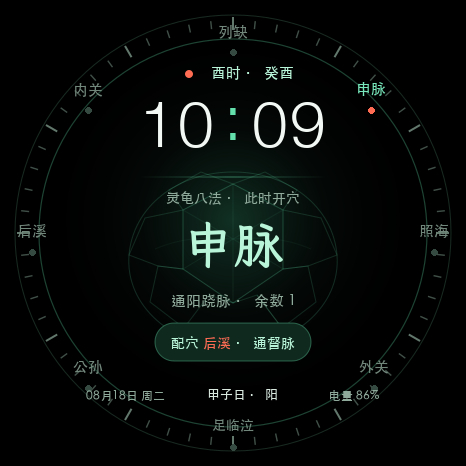

# 灵龟八法 · Amazfit GTR 4 表盘

面向 Amazfit GTR 4（466×466）的 Zepp OS 动态表盘。表盘根据当前日期与时辰计算灵龟八法结果，并显示主穴、配穴、经脉、干支、日期和电量。

> 本项目仅用于传统文化与表盘设计展示，不构成医疗建议。

## 表盘预览

<p align="center">
  
</p>

## 功能

- 24 小时制数字时间
- 时辰与干支显示
- 灵龟八法主穴、配穴及余数计算
- 八穴环形定位与当前穴位高亮
- 低对比度玄甲龟背纹背景
- 60 格环形分钟刻度与五分钟主刻度
- 日期、日干支及电量显示
- Amazfit GTR 4 真机适配

## 开发与构建

需要安装 Zepp OS Zeus CLI。

```bash
npm install -g @zeppos/zeus-cli
zeus build
```

真机预览：

```bash
zeus preview
```

## 字体资源

主穴位字模使用霞鹜臻楷生成。仓库保留生成后的 PNG 字模，不提交字体二进制文件。重新生成字模前，请按 `tools/fonts/README.md` 下载字体。

## 当前发布信息

- Zepp App ID：`1123978`
- 表盘版本：`1.6.2`
- 目标设备：Amazfit GTR 4
